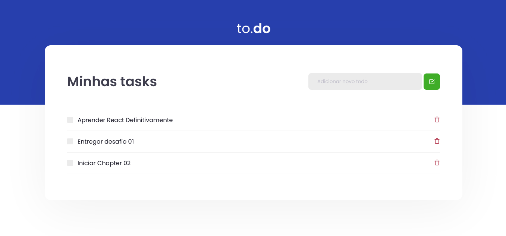

<h1 align="center">
  
</h1>

# to.do

Desafio 01 da trilha de React do Ignite.

## Features

Neste desafio, criamos três funcionalidades, que foram estas:
- Criar uma nova task e não permitir a criação da task sem um título
- Poder marcar como task concluída ou desmarcar
- Apagar um task existente

## Infos
Foi usado um template disponibilizado com toda estrutura e estilos aplicados